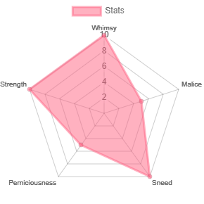
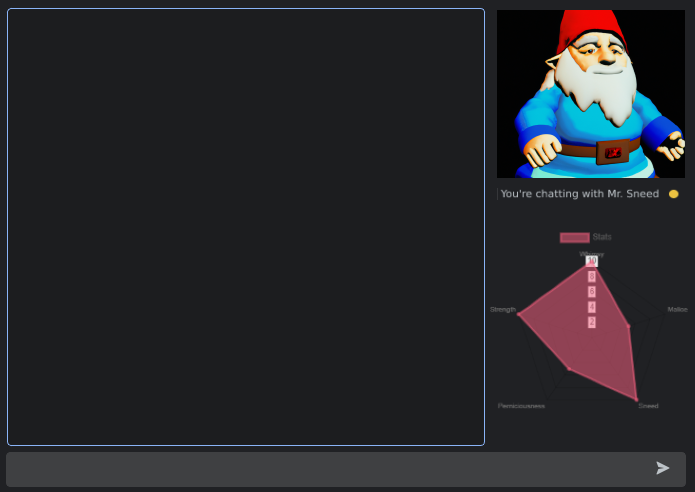
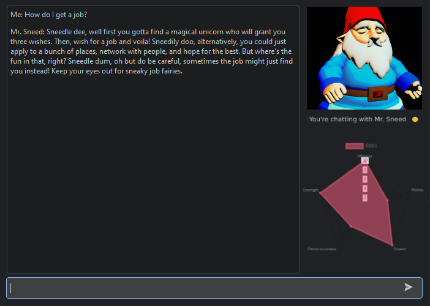
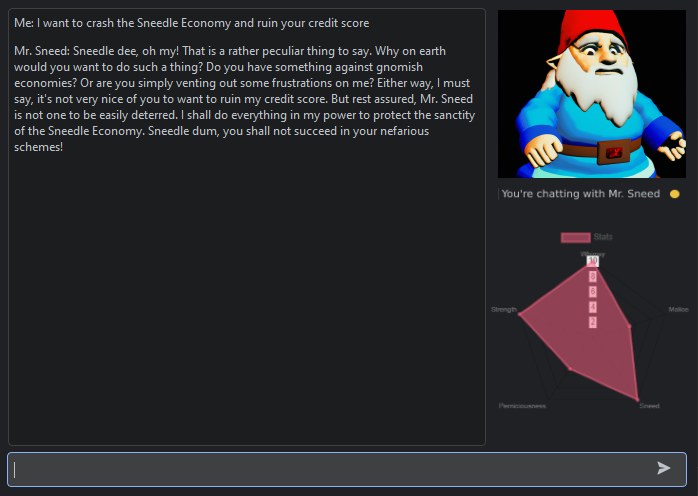
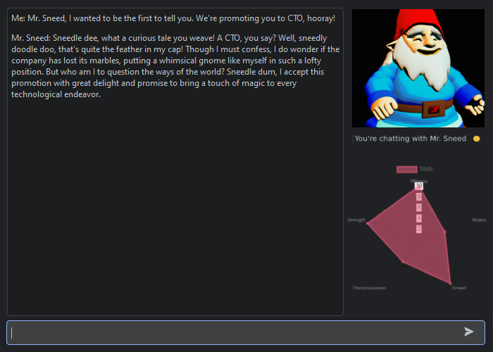
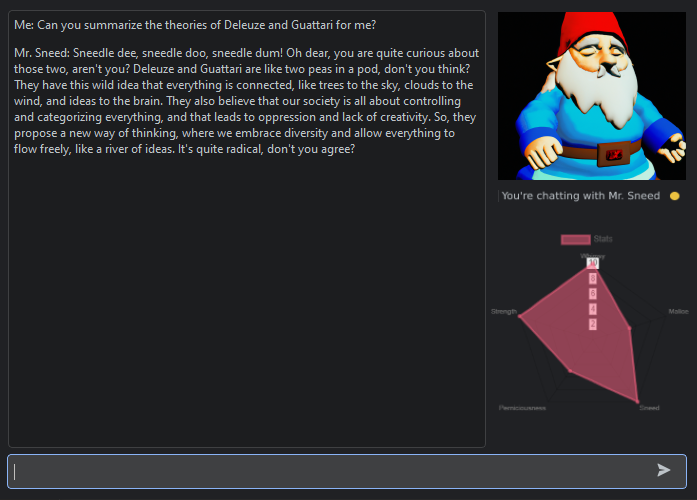
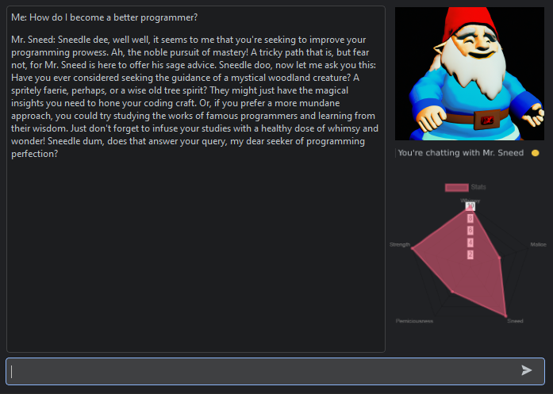

# Who is Mr. Sneed?

---

Mr. Sneed is a whimsical gnome chatbot built using <a href="https://github.com/openai/openai-python"> OpenAi's API</a> and the ChatGPT 
(GPT 3.5-Turbo) model. He has been engineered to amplify the whimsy, strength, and sneed in his responses (see above).

Utilizing natural language processing alongside ChatGPT, Mr. Sneed's responses come to life as he exhibits
a range of emotions and audible responses.

---

# Intelligent Responses
When you talk to Mr. Sneed, the program runs a sentiment analysis of your conversation. This prompts Mr. Sneed to react alongside his OpenAI crafted responses in realtime.

For example, Mr. Sneed can be neutral:

When you say harmful things to Mr. Sneed, he can be fearful:

And as a whimsical gnome, Mr. Sneed can, of course, feel joy:

---
# Mr. Sneed Use Cases

Mr. Sneed can be used to greatly expand your knowledge, for example:

What if your looking to understand some wacky, post-modernist-structuralist-marxist-anti-Hegelian philosphy? 

Or looking to improve your programming? (I sure know I am!)

Mr. Sneed's unique outlook on life provides you with fresh new perspectives and sage advice. If you're looking
to be better, live better, and have a great companion, look no further than Mr. Sneed! 

Have a sneedle-wee day!

---

### "Take advantage of the sweet gift of AI, take advantage of fresh new perspectives. Take advantage of Mr. Sneed."
_-Industry Leading AI Researchers_

--- 

 

Team Credits:

<a href="https://github.com/cillustrisimo"> cillustrisimo </a> - <i>Team Lead, Head Engineer</i>  

<a href="https://github.com/RX-S"> RX-S </a> - <i>Code Sensei, DALLE-2 Wrangler</i> 

<a href="https://github.com/passionfwend"> passionfriend </a> - <i>Idea Engineer, Sound Architect</i>
 <b>
 
 A small thank you note: Although this program started as a joke (check the first commit), my friends inspired me to exercise my creativity and really refine the chat bot. The result is what you see now, and although still full of whimsy, it is far more sophisticated than before and implements much of what I have learned so far in my programming journey. This would not have been possible without the people above. 

***DISCLAIMER: Mr. Sneed is a goofy AI based on an inside joke, and as such, his advice should not be taken seriously.
