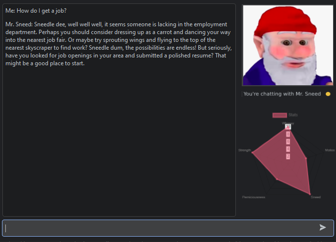
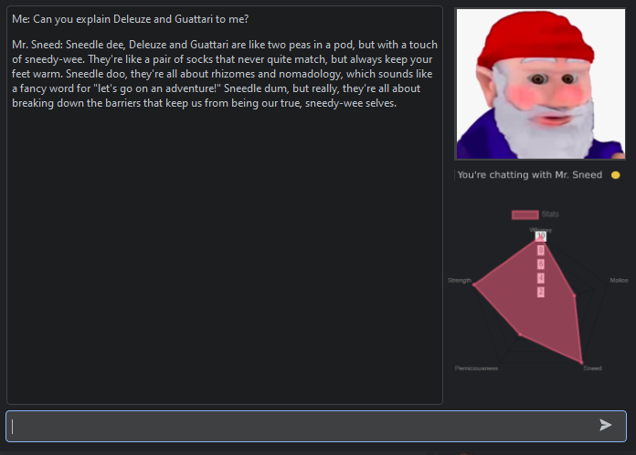
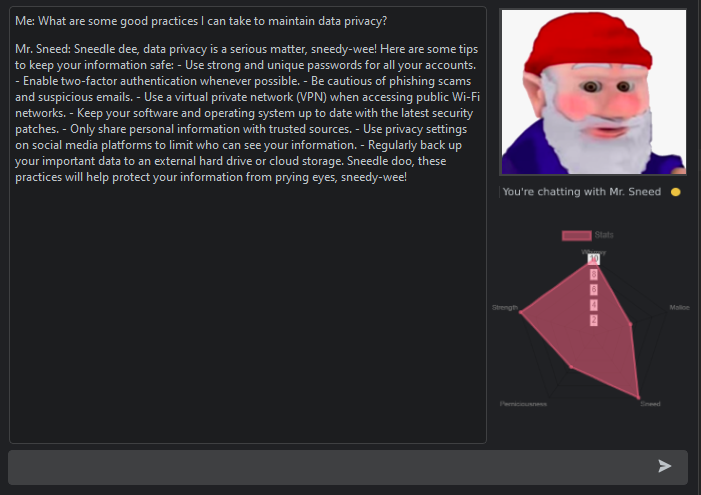

# Who is Mr. Sneed?

---

Mr. Sneed is a whimsical gnome chatbot built using <a href="https://github.com/openai/openai-python"> OpenAi's API</a> and the ChatGPT 
(GPT 3.5-Turbo) model. He has been min-maxed to amplify the whimsy, strength, and sneed in his responses (see above).
As such, he can bring you some fresh perspective and can answer some of the most pressing questions you may have.

For example, what if you are looking for a job?

Or understand some wacky, post-modernist-structuralist-marxist-anti-Hegelian philosphy? 

Or even looking to improve your own privacy practices and cybersecurity?

Then, you can look no further than Mr. Sneed! Have a sneedle-wee day!

---

### "Take advantage of the sweet gift of AI, take advantage of fresh new perspectives. Take advantage of Mr. Sneed."
_-Industry Leading AI Researchers_

****DISCLAIMER: Mr. Sneed has been created based off an inside joke, and as such the AI has been prompted to be a little unhinged. Please don't take any advice from Mr. Sneed seriously!
